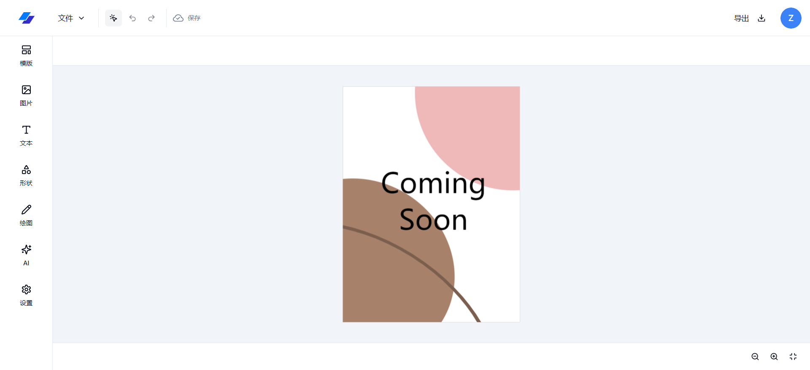
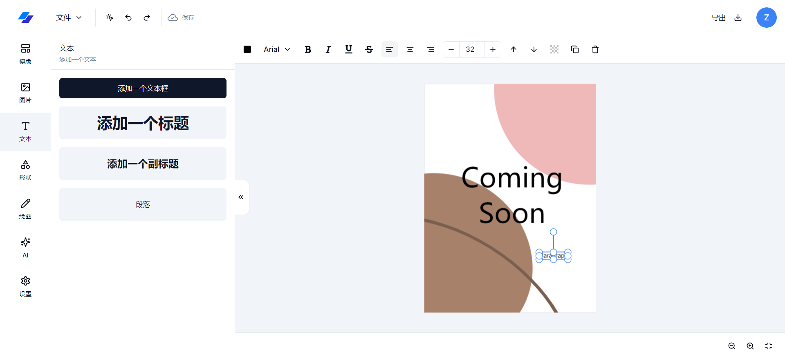
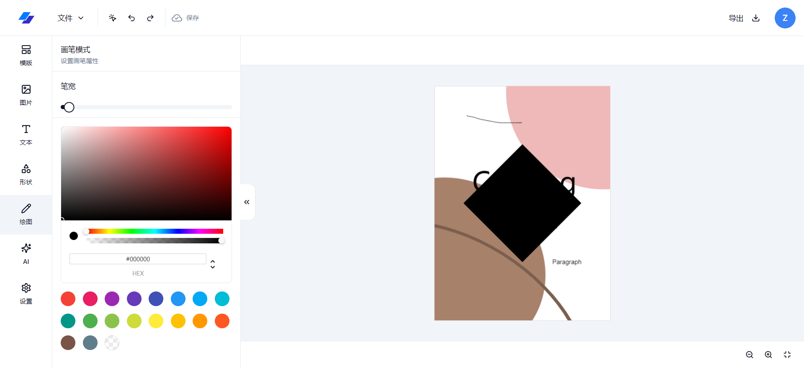
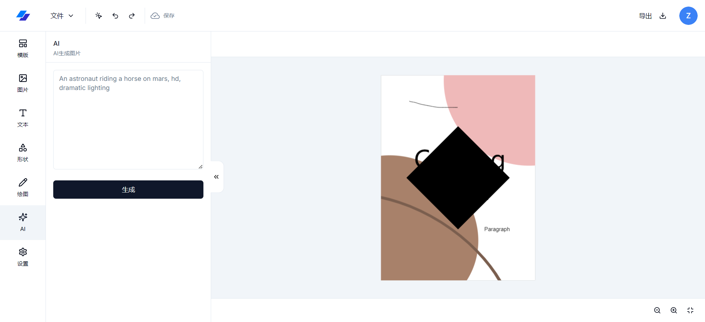

# Next-Image-Editor

### 介绍

Next-Image-Editor，基于 Next.js、fabric.js、shadcn/ui、TailWind css、Drizzle ORM、Hono.js 的一套开源图片编辑器。

### 一、在线预览地址

- vercel(需要翻墙)：https://next-image-editor-zc.vercel.app/
- netlify(无需翻墙)：https://next-image-editor-zc.netlify.app/

### 二、Git 仓库地址 (欢迎 Star⭐)

- GitHub：https://github.com/zczhao1992/next-image-editor.git

### 三、🔨🔨🔨 项目功能

- 🚀 采用最新技术找开发：Next14、TypeScript、shadcn/ui、fabric.js、Hono.js 等
- 🚀 使用 Next-auth.js 作为身份认证，支持 Google、Github 账号登录
- 🚀 使用 Drizzle ORM 及 PostgreSQL 作为数据库存储工具，数据库部署在 neon
- 🚀 基于 fabric.js 作为图片编辑的核心库
- 🚀 整个项目集成了 TypeScript
- 🚀 使用 unsplash 一个开源图片生成工具
- 🚀 使用 uploadthing 作为文件上传管理库
- 🚀 使用 stability-ai/stable-diffusion-3 作为 AI 图片生成工具（算力太贵了，已放弃。。）

### 四、安装使用步骤 📑

- **Clone：**

```text
# GitHub
git clone https://github.com/zczhao1992/next-image-editor.git
```

- **Install：**

```text
npm install
cnpm install

# npm install 安装失败，请升级 nodejs 到 16 以上，或尝试使用以下命令：
npm install --registry=https://registry.npm.taobao.org
```

- **Run：**

```text
npm run dev
```

- **Build：**

```text
# 开发环境
npm run build
```

### 五、项目截图

#### 1、首页：


#### 2、编辑器：






### 六、文件资源目录 📚

```text
next-image-editor
├─ drizzle                # drizzle orm
├─ public                 # 静态资源文件（忽略打包）
├─ src
│  ├─ app                 # 项目页面
│  ├─ components          # 全局组件
│  ├─ db                  # 数据库
│  ├─ features            # 业务功能
│  ├─ hooks               # 自定义hook
│  ├─ lib                 # 工具
│  ├─ auth.config.ts      # 身份认证配置
│  ├─ auth.ts             # 身份认证
│  └─ middleware.ts       # 中间件
├─ .eslintrc.json         # eslint配置
├─ .gitignore             # git 提交忽略
├─ components.json        # shadcn/ui 组件配置
├─ drizzle.config.ts      # drizzle配置
├─ next-env.d.ts          # 环境变量配置
├─ package-lock.json      # 依赖包包版本锁
├─ package.json           # 依赖包管理
├─ postcss.config.js      # postcss 配置
├─ README.md              # README 介绍
├─ tailwind.config.ts     # tailwind 配置
└─ tsconfig.json          # typescript 全局配置
```
